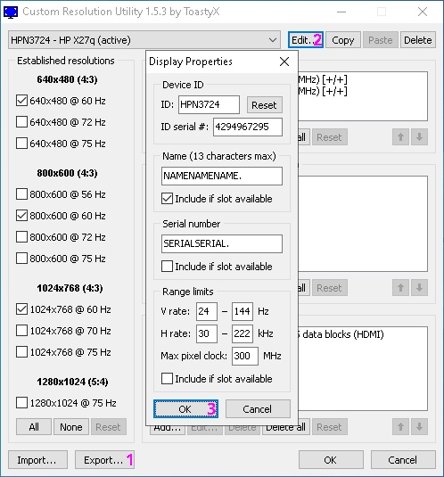

# Nika Read Only

- Say `No!` to officially endorsed cheating.
  - Say `No!` to controller aim assist.

- As of Season 23, for QEMU/KVM (formerly for Proton).

```shell
+----------+    +----------+    +------------+    +--------------+
| Linux PC | -> | QEMU/KVM | -> | Windows VM | -> | Apex Legends |
+----------+    +----------+    +------------+    +--------------+
```

## Introduction

- The goal of this project is to have a working Linux cheat that can run alongside Apex Legends on my i5-6600K 4c/4t Linux PC.


## Features

* [x] Stable CR3 shuffle for [Windows 10 20H1](https://archive.org/details/win-10-2004-english-x-64_202010)
* [x] Overlay based ESP for players and items
* [x] Press 5 / 6 / 7 / 8 / 9 / 0 to cycle LIGHT / ENERGY / SHOTGUN / HEAVY / SNIPER / GEAR items
* [x] Map radar
* [x] Spectators list
* [x] Humanized aimbot
* [x] Inside FOV circle, hold RMB (Right Mouse Button) to aimbot **skynade** (even behind cover)
* [x] Hold SHIFT to **lock on target** or **show ITEM / PLAYER / LEGEND names**
* [x] Toggle **aimbot** with CURSOR_LEFT; "**<**" symbol in the upper left corner of the screen
* [x] Toggle **ADS locking** with CURSOR_RIGHT; "**>**" symbol in the upper left corner of the screen
* [x] Toggle **triggerbot** with CURSOR_UP; "**^**" symbol in the upper left corner of the screen
* [x] Toggle hitbox with CURSOR_DOWN; `body`/`neck`/`head` text in the upper left corner of the screen
* [ ] Hold CAPS_LOCK to **superglide**
* [x] Press F8 to dump **r5apex** and scan for offsets
* [x] Press F9 twice to terminate cheat

### 0. Disclaimer

- This guide is for PCs that you can actually plug your monitor into iGPU (internal GPU in CPU), leaving your dGPU exclusively for the VM.

- A single GPU guide is available at: [ThisIsFair/Nika-Read-Only-SGPU](https://github.com/ThisIsFair/Nika-Read-Only-SGPU)

### 1. Environment set up in Linux

- Enter BIOS and enable Virtualization Technology:
  - VT-d for Intel (VMX)
  - AMD-Vi for AMD (SVM)
  - Enable "IOMMU"
  - Disable "Above 4G Decoding"

- Nested Virtualization for Intel:
```shell
sudo su
echo "options kvm_intel nested=0" > /etc/modprobe.d/kvm.conf
```

- Nested Virtualization for AMD:
```shell
sudo su
echo "options kvm_amd nested=0" > /etc/modprobe.d/kvm.conf
```

- Preload `vfio-pci` module so it can bind to PCI IDs:
```shell
sudo su
echo "softdep nvidia pre: vfio-pci" >> /etc/modprobe.d/kvm.conf
echo "softdep nouveau pre: vfio-pci" >> /etc/modprobe.d/kvm.conf
```

- Update initramfs:
```shell
<Fedora> sudo dracut --force
<Debian> sudo update-initramfs -c -k $(uname -r)
```


  <details>
    <summary>Install on <b>Fedora Linux (Fedora 42 KDE)</b>:</summary>

    sudo dnf install @virtualization
  </details>


  <details>
    <summary>Install on <b>Debian Linux (Debian 13 KDE)</b>:</summary>

    sudo apt update
    sudo apt install virt-manager
  </details>

### 1.1. Configure libvirt

- Edit `/etc/libvirt/qemu.conf` and uncomment (needed for **audio**):
```shell
#user = "libvirt-qemu"
user = "1000"
```

- Edit `/etc/libvirt/libvirtd.conf` and uncomment:
```shell
unix_sock_group = "libvirt"
unix_sock_rw_perms = "0770"
```

- Join **libvirt group** and enable **libvirt daemon**:
```shell
test $UID = 0 && exit
sudo usermod -aG libvirt $USER
sudo systemctl enable libvirtd.service
```

- Restart Linux PC.

- Virtual Machine Manager >> Edit >> Preferences >> General >> _check_ [x] Enable XML editing >> [Close]

- Virtual Machine Manager >> Edit >> Preferences >> New VM >> Storage format: Raw >> [Close]

- Install macchanger:
```shell
<Fedora> sudo dnf install macchanger
<Debian> sudo apt install macchanger
```

- Manually start `default virtual network` every reboot:
```shell
sudo virsh net-autostart default --disable
sudo virsh net-start default
sudo macchanger --mac=XX:XX:XX:XX:XX:XX virbr0
```

### 2. New VM set up in QEMU/KVM

- Virtual Machine Manager >> File >> New Virtual Machine

- Local install media (ISO image or CDROM) >> `Windows10.iso` >> Choose Memory and CPU settings >> _uncheck_ [ ] Enable storage for this virtual machine >> _check_ [x] Customize configuration before install >> [Finish]
  - Overview >> Chipset: Q35, **Firmware**: OVMF_CODE_4M.secboot >> [Apply]
  - [Add Hardware] >> Storage >> Device type: Disk device >> Bus type: SATA >> Create a disk image for the virtual machine: 240 GiB >> Advanced options >> Serial: B4NN3D53R14L >> [Finish]
  - [Begin Installation] >> Virtual Machine >> Shut Down >> Force Off

- [Add Hardware] >> TPM >> Type: Emulated >> Model: CRB >> Version: 2.0 >> [Finish]

- Virtual Machine Manager >> [Open] >> View >> Details >> Video QXL >> Model: VGA >> [Apply]

- Virtual Machine Manager >> [Open] >> View >> Details >> NIC :xx:xx:xx >> XML


- Replace `<mac address="52:54:00:xx:xx:xx"/>` and [Apply]:
  <details>
    <summary>Spoiler</summary>

  ```shell
  <mac address="xx:xx:xx:xx:xx:xx"/>
  ```
  </details>

- Virtual Machine Manager >> [Open] >> View >> Details >> SATA Disk 1 >> XML


- Replace `<driver name="qemu" type="raw"/>` and [Apply]:
  <details>
    <summary>Spoiler</summary>

  ```shell
  <driver name="qemu" type="raw" cache="none" discard="ignore"/>
  ```
  </details>

### 2.1 Configure VM

- Virtual Machine Manager >> [Open] >> View >> Details >> Overview >> XML


- Replace `<domain type="kvm">` and [Apply]:
  <details>
    <summary>Spoiler <b>(do NOT use this example, instead modify it with your own SMBIOS data; sudo dmidecode)</b></summary>

  ```shell
  <domain type="kvm" xmlns:qemu="http://libvirt.org/schemas/domain/qemu/1.0">
    <qemu:commandline>
      <qemu:arg value="-smbios"/>
      <qemu:arg value="type=1,manufacturer=HP,product=HP Laptop 14s-dq2xxx,version=23.41,serial=D3E4F56789"/>
      <qemu:arg value="-smbios"/>
      <qemu:arg value="type=2,manufacturer=HP,product=87FD,version=34.12,serial=B1C2D3E4F56789"/>
      <qemu:arg value="-smbios"/>
      <qemu:arg value="type=3,manufacturer=HP,version=23.41,serial=D3E4F56789"/>
      <qemu:arg value="-smbios"/>
      <qemu:arg value="type=4,sock_pfx=U3E1,manufacturer=Intel(R) Corporation,version=11th Gen Intel(R) Core(TM) i5-1135G7 @ 2.40GHz,processor-id=0xBFEBFBFF000806C1"/>
      <qemu:arg value="-smbios"/>
      <qemu:arg value="type=17,manufacturer=Samsung,part=M471A5244CB0-CWE,speed=3200,serial=D3E4F5"/>
      <qemu:arg value="-smbios"/>
      <qemu:arg value="type=8,internal_reference=J1A1,external_reference=Keyboard,connector_type=0x0F,port_type=0x0D"/>
      <qemu:arg value="-smbios"/>
      <qemu:arg value="type=8,internal_reference=J1A1,external_reference=Mouse,connector_type=0x0F,port_type=0x0E"/>
      <qemu:arg value="-smbios"/>
      <qemu:arg value="type=9,slot_designation=J6C1,slot_type=0xAA,slot_data_bus_width=0x0D,current_usage=0x04,slot_length=0x04,slot_id=0x01,slot_characteristics1=0x04,slot_characteristics2=0x03"/>
    </qemu:commandline>
  ```
  </details>

  - VM created by QEMU is Intel, do not use AMD data.


- Replace `</metadata>` and [Apply]:
  <details>
    <summary>Spoiler</summary>

  ```shell
    <vmware xmlns="http://www.vmware.com/schema/vmware.config">
      <config>
        <entry name="hypervisor.cpuid.v0" value="FALSE"/>
      </config>
    </vmware>
  </metadata>
  ```
  </details>


- Replace from `<memory unit="KiB">4194304</memory>` to `<vcpu placement="static">2</vcpu>` and [Apply]:
  <details>
    <summary>Spoiler <b>(use a commercial memory size like 8, 16, or 24 GiB; vcpu example for 8 threads host CPU)</b></summary>

  ```shell
  <memory unit="GiB">24</memory>
  <currentMemory unit="GiB">24</currentMemory>
  <vcpu placement="static">8</vcpu>
  ```
  </details>


- Replace from `<features>` to `</clock>` and [Apply]:
  <details>
    <summary>Spoiler (example for 4 cores 8 threads host CPU)</summary>

  ```shell
  <features>
    <acpi/>
    <apic/>
    <hyperv mode="custom">
      <relaxed state="off"/>
      <vapic state="off"/>
      <spinlocks state="off"/>
      <vpindex state="off"/>
      <runtime state="off"/>
      <synic state="off"/>
      <stimer state="off"/>
      <reset state="off"/>
      <vendor_id state="off"/>
      <frequencies state="off"/>
      <reenlightenment state="off"/>
      <tlbflush state="off"/>
      <ipi state="off"/>
      <evmcs state="off"/>
      <avic state="off"/>
    </hyperv>
    <kvm>
      <hidden state="on"/>
    </kvm>
    <ioapic driver="kvm"/>
    <msrs unknown="fault"/>
    <pmu state="on"/>
    <smm state="on"/>
    <vmport state="off"/>
    <ps2 state="on"/>
  </features>
  <cpu mode="host-passthrough" check="none" migratable="off">
    <topology sockets="1" cores="4" threads="2"/>
    <feature policy="disable" name="hypervisor"/>
    <feature policy="require" name="svm"/>
    <feature policy="require" name="vmx"/>
    <feature policy="disable" name="x2apic"/>
    <feature policy="require" name="topoext"/>
  </cpu>
  <clock offset="localtime">
    <timer name="tsc" present="yes" tickpolicy="discard" mode="native"/>
    <timer name="hpet" present="yes"/>
    <timer name="rtc" present="yes"/>
    <timer name="pit" present="yes"/>
    <timer name="kvmclock" present="no"/>
    <timer name="hypervclock" present="no"/>
  </clock>
  ```
  </details>


- Replace from `<memballoon model="virtio">` to `</memballoon>` and [Apply]:
  <details>
    <summary>Spoiler</summary>

  ```shell
  <memballoon model="none"/>
  ```
  </details>


- Replace `<audio id="1" type="spice"/>` and [Apply]:
  <details>
    <summary>Spoiler <b>(for pipewire sound, not required)</b></summary>

  ```shell
  <audio id="1" type="pipewire" runtimeDir="/run/user/1000">
    <input name="qemuinput"/>
    <output name="qemuoutput"/>
  </audio>
  ```
  </details>

- Virtual Machine Manager >> [Open] >> View >> Details >> Tablet >> [Remove]

- Virtual Machine Manager >> [Open] >> View >> Details >> Serial 1 >> [Remove]

- Virtual Machine Manager >> [Open] >> View >> Details >> Channel (spice) >> [Remove]

- Virtual Machine Manager >> [Open] >> View >> Details >> Controller VirtIO Serial 0 >> [Remove]

### 2.2 Install Windows

- Virtual Machine Manager >> [Open] >> View >> Details >> Boot Options >> Boot device order:
  * [x] SATA Disk 1 >> [Apply]

### 3. VFIO GPU passthrough (on Linux PC)

- Find GPU location with: `lspci -v | grep -i VGA`
```shell
00:02.0 VGA compatible controller: Intel Corporation HD Graphics 530 (rev 06) (prog-if 00 [VGA controller])
02:00.0 VGA compatible controller: NVIDIA Corporation TU106 [GeForce RTX 2070] (rev a1) (prog-if 00 [VGA controller])
```

- GeForce RTX 2070 has 4 PCI IDs: `lspci -v | grep -i NVIDIA`
```shell
02:00.0 VGA compatible controller: NVIDIA Corporation TU106 [GeForce RTX 2070] (rev a1) (prog-if 00 [VGA controller])
        Subsystem: NVIDIA Corporation TU106 [GeForce RTX 2070]
02:00.1 Audio device: NVIDIA Corporation TU106 High Definition Audio Controller (rev a1)
        Subsystem: NVIDIA Corporation Device 1f02
02:00.2 USB controller: NVIDIA Corporation TU106 USB 3.1 Host Controller (rev a1) (prog-if 30 [XHCI])
        Subsystem: NVIDIA Corporation Device 1f02
02:00.3 Serial bus controller: NVIDIA Corporation TU106 USB Type-C UCSI Controller (rev a1)
        Subsystem: NVIDIA Corporation Device 1f02
```

- Find PCI IDs with: `lspci -n -s 02:00`
```shell
02:00.0 0300: 10de:1f02 (rev a1)
02:00.1 0403: 10de:10f9 (rev a1)
02:00.2 0c03: 10de:1ada (rev a1)
02:00.3 0c80: 10de:1adb (rev a1)
```

- Edit `/etc/default/grub`, use either **intel_iommu=on** or **amd_iommu=on**:
```shell
GRUB_CMDLINE_LINUX="module_blacklist=nvidia,nouveau vfio-pci.ids=10de:1f02,10de:10f9,10de:1ada,10de:1adb intel_iommu=on iommu=pt"
```

- Update GRUB and restart Linux PC:
```shell
<Fedora> sudo grub2-mkconfig -o /boot/grub2/grub.cfg
<Debian> sudo grub-mkconfig -o /boot/grub/grub.cfg
```

- Inspect IOMMU enabled with:
```shell
if compgen -G "/sys/kernel/iommu_groups/*/devices/*" > /dev/null; then echo "IOMMU enabled."; fi
```

- Inspect kernel driver in use with: `lspci -k -s 02:00`
```lua
02:00.0 VGA compatible controller: NVIDIA Corporation TU106 [GeForce RTX 2070] (rev a1)
        Subsystem: NVIDIA Corporation TU106 [GeForce RTX 2070]
        Kernel driver in use: vfio-pci
        Kernel modules: nouveau
02:00.1 Audio device: NVIDIA Corporation TU106 High Definition Audio Controller (rev a1)
        Subsystem: NVIDIA Corporation Device 1f02
        Kernel driver in use: vfio-pci
        Kernel modules: snd_hda_intel
02:00.2 USB controller: NVIDIA Corporation TU106 USB 3.1 Host Controller (rev a1)
        Subsystem: NVIDIA Corporation Device 1f02
        Kernel driver in use: xhci_hcd
02:00.3 Serial bus controller: NVIDIA Corporation TU106 USB Type-C UCSI Controller (rev a1)
        Subsystem: NVIDIA Corporation Device 1f02
        Kernel driver in use: vfio-pci
        Kernel modules: i2c_nvidia_gpu
```

- Not loaded as a module, `xhci_hcd` will be managed by libvirt.

### 3.1 Add passthrough GPU devices to Windows VM

- Virtual Machine Manager >> [Open] >> View >> Details >> [Add Hardware] >> PCI Host Device:
  - 02:00.0 NVIDIA Corporation TU106 [GeForce RTX 2070] >> **[Finish]**
  - 02:00.1 NVIDIA Corporation TU106 High Definition Audio Controller >> **[Finish]**
  - 02:00.2 NVIDIA Corporation TU106 USB 3.1 Host Controller >> **[Finish]**
  - 02:00.3 NVIDIA Corporation TU106 USB Type-C UCSI Controller >> **[Finish]**

- Install GPU drivers on Windows VM.

### 4. Configure evdev passthrough (on Linux PC)

- Find your **mouse** and **keyboard** with:
```shell
ls -l /dev/input/by-id/

usb-COMPANY_USB_Device-event-if02 -> ../event7
usb-COMPANY_USB_Device-event-kbd -> ../event4
usb-COMPANY_USB_Device-if01-event-mouse -> ../event5
usb-COMPANY_USB_Device-if01-mouse -> ../mouse0
usb-COMPANY_USB_Device-if02-event-kbd -> ../event6
usb-SONiX_USB_DEVICE-event-if01 -> ../event9
usb-SONiX_USB_DEVICE-event-kbd -> ../event8
```

- By symlink `../mouse0` you find that `usb-COMPANY_USB_Device` is your **mouse**.

- You are looking for `event-mouse` and `event-kbd`:
  - `usb-COMPANY_USB_Device-if01-event-mouse -> ../event5` is your **mouse**.
  - `usb-SONiX_USB_DEVICE-event-kbd -> ../event8` is your **keyboard**.

- Edit `/etc/libvirt/qemu.conf` and uncomment:
```shell
cgroup_device_acl = [
        "/dev/null", "/dev/full", "/dev/zero",
        "/dev/random", "/dev/urandom",
        "/dev/ptmx", "/dev/kvm", "/dev/kqemu",
        "/dev/rtc", "/dev/hpet",
        "/dev/input/by-id/usb-COMPANY_USB_Device-if01-event-mouse",
        "/dev/input/by-id/usb-SONiX_USB_DEVICE-event-kbd",
        "/dev/input/event5",
        "/dev/input/event8",
        "/dev/userfaultfd"
]
```

- Include `cgroup_device_acl` as above, replacing `event-kbd`, `event-mouse`, and the path to each symlink `/dev/input/eventX`.

- Restart libvirtd:
```shell
sudo systemctl restart libvirtd
```

- Toggle input with LEFT_CTRL + RIGHT_CTRL when needed.

### 4.1 Configure VM

- Virtual Machine Manager >> [Open] >> View >> Details >> Overview >> XML


- Replace `</qemu:commandline>` and [Apply]:
  <details>
    <summary>Spoiler</summary>

  ```shell
    <qemu:arg value="-object"/>
    <qemu:arg value="input-linux,id=kbd1,evdev=/dev/input/by-id/usb-SONiX_USB_DEVICE-event-kbd,grab_all=on,repeat=on"/>
    <qemu:arg value="-object"/>
    <qemu:arg value="input-linux,id=mouse1,evdev=/dev/input/by-id/usb-COMPANY_USB_Device-if01-event-mouse"/>
  </qemu:commandline>
  ```
  </details>

- Join **input group**:
```shell
test $UID = 0 && exit
sudo usermod -aG input $USER
```


  <details>
    <summary>Manually stop `SELinux` every reboot on <b>Fedora Linux</b>:</summary>

    sudo setenforce 0
  </details>


  <details>
    <summary>Permanently disable `AppArmor` on <b>Debian Linux</b>:</summary>

    sudo systemctl stop apparmor
    sudo systemctl disable apparmor
  </details>

- Restart Linux PC.

### 5. Usage

- For **window settings**, open; System Settings >> Window Management >> Window Rules >> Import... >> GLFW.kwinrule
  - Also check; System Settings >> Display & Monitor >> Scale: 100%

- Virtual Machine Manager >> [Open] >> View >> Details >> Video VGA >> Model: None >> [Apply]

- You will be using video output from passthrough GPU instead of VGA virtual GPU.

| Method                       | Latency   | ESP          | Cons                         |
| ---------------------------- | --------- | ------------ | ---------------------------- |
| Cable                        | 0 ms      | Glow         | Overlay on 2nd monitor       |
| Capture card                 | 30-300 ms | Overlay+Glow | Investment for faster device |
| Steam Remote Play            | 10 ms     | Overlay+Glow | Encoded video                |

### 5.1 Cable

- Plug monitor into passthrough GPU.

### 5.2 Capture card


  <details>
    <summary>Install `gstreamer1.0-tools` on <b>Debian Linux</b>:</summary>

    sudo apt install gstreamer1.0-tools
  </details>

- Plug capture card into passthrough GPU.

- Open capture card raw feed with:
```shell
gst-launch-1.0 -v v4l2src device=/dev/video0 ! video/x-raw,width=1920,height=1080,framerate=60/1 ! videoconvert ! autovideosink
```

### 5.3 Steam Remote Play

- Take note of **guest local IP**:
```shell
C:\>ipconfig

Windows IP Configuration


Ethernet adapter Ethernet:

   Connection-specific DNS Suffix  . :
   IPv4 Address. . . . . . . . . . . : 192.168.122.221
   Subnet Mask . . . . . . . . . . . : 255.255.255.0
   Default Gateway . . . . . . . . . : 192.168.122.1

C:\>
```


  <details>
    <summary>Install `Steam` on <b>Fedora Linux</b>:</summary>

    sudo dnf install https://download1.rpmfusion.org/nonfree/fedora/rpmfusion-nonfree-release-$(rpm -E %fedora).noarch.rpm
    sudo dnf install steam
  </details>

- Start `Steam` on host with:
```shell
steam -console
```

- Steam >> Console >> `connect_remote 192.168.122.221:27036` >> [KEY_ENTER]
  - You need to manually specify **guest local IP** for direct connection.

- Steam >> Settings >> Remote Play >> Computers & Devices >> DESKTOP-XXXXXX >> [Connect]

### 6. Nika Read Only (on Linux PC)

- Install:
```shell
cd path/to/extracted/repository
chmod +x nika
```

- Run:
```shell
cd path/to/extracted/repository
sudo -E ./nika
```

### 7. Spoof QEMU (mandatory)

- This script is based on: [Scrut1ny/Hypervisor-Phantom](https://github.com/Scrut1ny/Hypervisor-Phantom)


  <details>
    <summary>Build on <b>Fedora Linux</b>:</summary>

  ```shell
  sudo dnf builddep qemu
  sudo dnf install acpica-tools
  ```
  </details>


  <details>
    <summary>Build on <b>Debian Linux</b>:</summary>

  ```shell
  sudo apt build-dep qemu
  sudo apt install acpica-tools
  ```
  </details>

- Run `qemupatch.sh` to clone, patch, and build QEMU with generated data.

- Virtual Machine Manager >> [Open] >> View >> Details >> Overview >> XML


- Replace from `<pm>` to `</emulator>` and [Apply]:
  <details>
    <summary>Spoiler</summary>

  ```shell
  <pm>
    <suspend-to-mem enabled="yes"/>
    <suspend-to-disk enabled="no"/>
  </pm>
  <devices>
    <emulator>/usr/local/bin/qemu-system-x86_64</emulator>
  ```
  </details>


- Replace `</qemu:commandline>` and [Apply]:
  <details>
    <summary>Spoiler <b>(not required, ignore this)</b></summary>

  ```shell
    <qemu:arg value="-acpitable"/>
    <qemu:arg value="file=/usr/local/bin/ssdt1.aml"/>
  </qemu:commandline>
  ```
  </details>

### 7.1 Spoof OVMF (mandatory)

- This script is based on: [Scrut1ny/Hypervisor-Phantom](https://github.com/Scrut1ny/Hypervisor-Phantom)


  <details>
    <summary>Build on <b>Fedora Linux</b>:</summary>

  ```shell
  sudo dnf install g++
  sudo dnf install nasm
  sudo dnf install python3-virt-firmware
  ```
  </details>


  <details>
    <summary>Build on <b>Debian Linux</b>:</summary>

  ```shell
  sudo apt install g++
  sudo apt install nasm
  sudo apt install python3-virt-firmware
  ```
  </details>

- Run `edk2patch.sh` to clone, patch, and build OVMF with generated data.

- Virtual Machine Manager >> [Open] >> View >> Details >> Overview >> XML


- Replace from `<os firmware="efi">` to `</os>` and [Apply]:
  <details>
    <summary>Spoiler</summary>

  ```shell
  <os>
    <type arch="x86_64" machine="pc-q35-9.2">hvm</type>
    <loader readonly="yes" secure="yes" type="pflash" format="qcow2">/usr/share/edk2/ovmf/OVMF_CODE_4M.patched.qcow2</loader>
    <nvram format="qcow2">/usr/share/edk2/ovmf/OVMF_VARS_4M.patched.qcow2</nvram>
    <bootmenu enable="yes"/>
  </os>
  ```
  </details>

### 7.2 Spoof EDID

- Pinnacle of HWID ban (EAC case).

| Ban # | Public IP | Router MAC | Monitor 1 | Monitor 2 |
| ----- | --------- | ---------- | --------- | --------- |
| 1     | Flagged   | Flagged    | Flagged   |           |
| 2     | Flagged   | Flagged    | Banned    |           |
| 3     | Flagged   | Flagged    |           | Flagged   |
| 4     | Flagged   | Banned     |           | Banned    |

- Download CRU from: [`CRU thread`](https://www.monitortests.com/forum/Thread-Custom-Resolution-Utility-CRU).

- Backup original EDID (1).

- Modify current EDID (2).

- Apply modified EDID (3).

- Save modified EDID (1).



- Download EDWriter from: [`EDWriter thread`](https://www.monitortests.com/forum/Thread-EDID-DisplayID-Writer).

- Write modified EDID.

| Capture Card               | Dummy Plug        |
| -------------------------- | ----------------- |
| Game Capture HD60 S+       | [`Fueran HDMI-2K-3P`](https://www.amazon.com/dp/B06XSY9THQ/) (NA) |
| Game Capture HD60 X        | [`Fueran HDMI-2K-3P`](https://www.amazon.de/dp/B06XSY9THQ/) (EU) |
| Game Capture 4K60 Pro      |                   |
| Game Capture 4K60 Pro MK.2 |                   |
| Game Capture 4K60 S+       |                   |
| Game Capture 4K X          |                   |
| Game Capture 4K Pro        |                   |

### 7.3 Spoof GPU (tested from 51x to 57x)

- Disable ROM BAR for each PCI Host Device:
  - Virtual Machine Manager >> [Open] >> View >> Details >> PCI 0000:xx:xx.x >> ROM BAR: [ ] _uncheck_ >> [Apply]

- Check old UUID with `nvidia-smi -L`.
- Run the cheat BEFORE the game at least once.
- Check new UUID with `nvidia-smi -L`.

### 8. memflow-kvm (not required, ignore this)


  <details>
    <summary>Install <b>dkms</b> on <b>Fedora Linux</b>:</summary>

    sudo dnf install kernel-devel-$(uname -r)
    sudo dnf install kernel-devel-matched-$(uname -r)
    sudo dnf install dkms
  </details>


  <details>
    <summary>Install <b>dkms</b> on <b>Debian Linux</b>:</summary>

    sudo apt install linux-headers-amd64=6.12.38-1
    sudo apt install dkms
  </details>

- Download `memflow-0.2.1-source-only.dkms.tar.gz` from:
https://github.com/memflow/memflow-kvm/releases

- Install:
```shell
sudo dkms install --archive=memflow-0.2.1-source-only.dkms.tar.gz
```

- Run:
```shell
sudo modprobe memflow
cd path/to/extracted/repository
sudo -E ./nika
```

### 8.1 Spoof network (not required, ignore this)

- This step is a journey on it's own. Initially you should skip it, but return later when you feel prepared.

- You should set another router between your machine and your ISP router.

- Most routers allow you to change (clone) WAN and WLAN network identifier (MAC address), yet what you need to periodically change is LAN network identifier, because that is what will be in your ARP table (arp -a) and what is collected for identification.

- Educate yourself about [DD-WRT](https://dd-wrt.com/) or [OpenWRT](https://openwrt.org/), and then shop locally for a compatible router:
  - **Shop locally** as you will be looking at the product tag for **brand**, **model**, and specially **version**.
  - Updating will be as simple as selecting **factory-to-ddwrt.bin** file in your router update page, for that specific brand+model+version.

- For DD-WRT go to: Administration >> Management >> Remote Access >> Telnet Management >> _check_ [x] Enable >> [Save] >> [Reboot Router]

- Telnet to your router, authenticate and enter:
```shell
nvram set lan_hwaddr=XX:XX:XX:XX:XX:XX (set LAN new MAC address)
nvram get lan_hwaddr
nvram commit
reboot
```

- For DD-WRT go to: Setup >> MAC Address Clone >> _check_ [x] Enable >> [Save]
  - Clone WAN MAC (set WAN new MAC address)
  - Clone Wireless MAC (set Wireless new MAC address)
  - [Save]

- For DD-WRT go to: Administration >> Management >> [Reboot Router]
