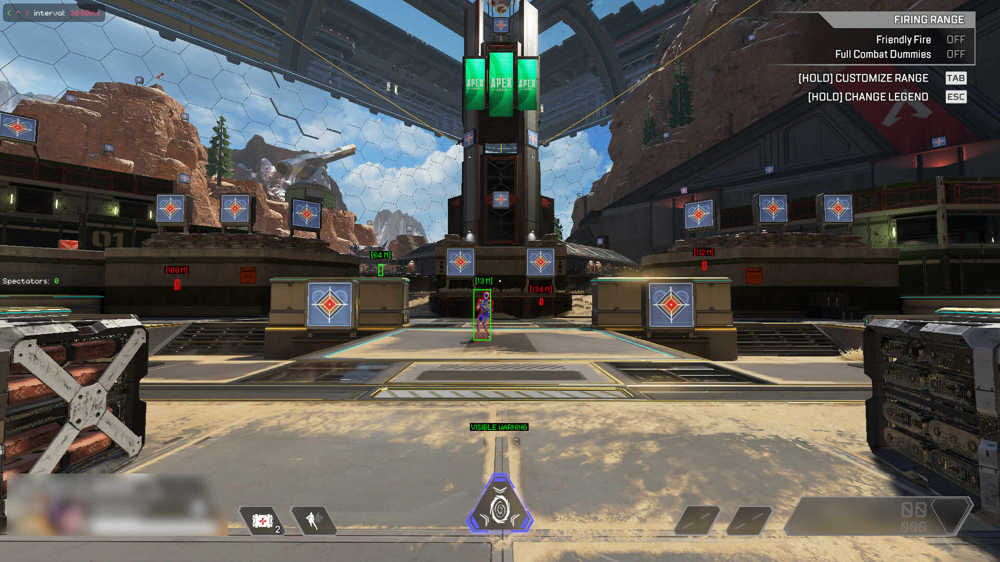

# Nika Read Only

- Apex Legends external cheat for Linux.

## Introduction

- The goal of this project is to have a working Linux cheat that can run alongside Apex Legends on my i5-6600K 4c/4t Linux PC.
- This a modification of: [Pesci-Apu/Nika](https://github.com/Pesci-Apu/Nika).
- With an overlay taken from: [Gerosity/zap-client-Read-Only-](https://github.com/Gerosity/zap-client-Read-Only-).
- The code remains simple and clean. You can read it out and understand how the overlay is added.
- Lines were commented out with a "**//_**" prefix or added with a "**//_add**" suffix. Also "**//_begin**" and "**//_end**" was used for large blocks.

## Credits

- [x] (UC) **Acknowledge**
- [x] (UC) **Gerosity**

## Features

* [x] Memory writing Glow ESP was replaced with overlay based ESP
* [x] Spectators list (overlay based)
* [x] Added _AIMBOT_ZOOMED_MAX_MOVE_ and _AIMBOT_HIPFIRE_MAX_MOVE_ to limit mouse speed
* [x] Quickly disable/enable **aimbot** with CURSOR_LEFT; "**<**" symbol in the upper left corner of the screen
* [x] Toggle **ADS locking** with CURSOR_RIGHT; "**>**" symbol in the upper left corner of the screen
* [x] Quickly enable/disable **triggerbot** auto fire with CURSOR_UP; "**^**" symbol in the upper left corner of the screen
* [x] Hold SHIFT to **lock on target** and **triggerbot** auto fire



### 1. Environment set up in Linux

<details>
<summary>Install dependencies (<b>Arch</b>):</summary>

    sudo pacman -Sy libudev0 cmake xorg-server git base-devel libx11 libxtst
</details>
OR
<details>
<summary>Install dependencies (<b>Debian</b>):</summary>

    sudo apt-get install -y libudev-dev
    sudo apt install cmake xorg-dev libglu1-mesa-dev libxrandr-dev libxinerama-dev libxcursor-dev libxi-dev
    sudo apt install -y libudev-dev libglu1-mesa-dev libxkbcommon-dev libwayland-dev git cmake g++ gcc libinput-dev libsoil-dev
    sudo apt-get install build-essential
    sudo apt-get install libx11-dev
    sudo apt-get install libxtst-dev
</details>

### 2. Build & Install GLFW

``` shell
git clone https://github.com/glfw/glfw.git
cd glfw
mkdir build
cd build
cmake ..
make
sudo make install
```

### 3. Build & Run

``` shell
git clone https://github.com/Ape-xCV/Nika-Read-Only.git
cd Nika-Read-Only
mkdir build
cd build
cmake ..
make
sudo ./main
```

### 4. CachyOS + KDE + NVIDIA proprietary driver

- You need to right-click Apex Legends in your taskbar and check: More >> Keep Below Others.
- Set to "**Borderless Window**" in-game, press ESC >> Settings >> Video >> Display Mode.
- Auto hide your taskbar, right-click it >> Enter Edit Mode >> Visibility: **Auto hide**.
